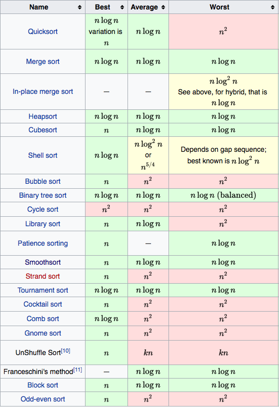
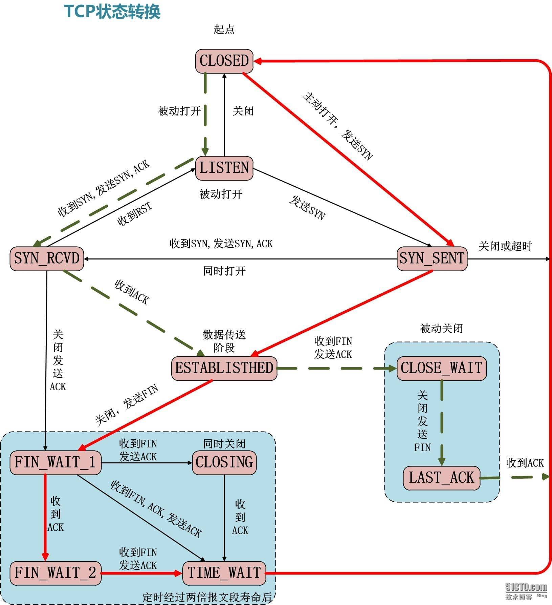

> **注: 如果文章打不开, 可以发 Issues 或者自行 Google 搜索找到新的文章地址, 发 PR. 提前感谢.**

## 一. 收集的文章

#### 1. [日访问量百亿级的应用如何做缓存架构设计](https://blog.didiyun.com/index.php/2018/05/22/weibo-cache/)

> 新浪微博技术专家陈波为大家讲解了**微博Cache架构的设计实践过程。**

#### 2. [微服务系统之认证管理详解](https://mp.weixin.qq.com/s/PRSbOYVX-aBmp7S_0qYeuQ)  

> 微服务大行其道，微服务安全也是非常热门的话题。本文向大家分享微服务系统中认证管理相关技术。其中包括用户认证、网关和 API 认证、系统间和系统内的认证，以及我们的统一认证管理系统 IAM。 

#### 3. [10 分钟理解什么是 OAuth 2.0 协议](https://deepzz.com/post/what-is-oauth2-protocol.html)

> OAuth 2.0 是一个行业的标准授权协议。OAuth 2.0 专注于简化客户端开发人员，同时为 Web 应用程序，桌面应用程序，手机和客厅设备提供特定的授权流程。
>
> 它的最终目的是为第三方应用颁发一个有时效性的令牌 token。使得第三方应用能够通过该令牌获取相关的资源。常见的场景就是：第三方登录。当你想要登录某个论坛，但没有账号，而这个论坛接入了如 QQ、Facebook 等登录功能，在你使用 QQ 登录的过程中就使用的 OAuth 2.0 协议。

#### 4. [Go 空死循环导致的调度器无法调度](https://rakyll.org/scheduler/)

```golang

package main

import (
	"log"
	"runtime"
	// "time"
)

func main() {
	runtime.GOMAXPROCS(4)
	ch := make(chan bool)

	go func() {
		for {
			ch <- true
			log.Println("sent")
		}
	}()

	go func() {
		for {
			re := <-ch
			log.Println("received:", re)
		}
	}()

	// 运行一段时间会卡死
	for {
		// log.Println("=========Deadloop========")
		// time.Sleep(time.Second)
	}
}

```

还可参考:  

- [https://gocn.vip/question/2116](https://gocn.vip/question/2116)
- [https://github.com/golang/go/issues/15442](https://github.com/golang/go/issues/15442)  

#### 5. [一篇好TM长的关于配置中心的文章](http://jm.taobao.org/2016/09/28/an-article-about-config-center/)  

> 讲述了配置中心出现的必然, 论证了大型分布式系统是必须配置中心的, 并且配置中心需要有导入导出功能, 以及配置中心和注册中心的区别.

#### 6. [如何实现靠谱的分布式锁？](https://mp.weixin.qq.com/s?__biz=MzIwMzg1ODcwMw==&mid=2247488347&idx=1&sn=057fb356decaf3cbf703d7ab600f8d3b&chksm=96c9a53ba1be2c2d7a530ef02bcd9eb1f1bef91c29473abecab8e568a065882961e6210d6307&mpshare=1&scene=1&srcid=0825XVuWFKkAvRpbtak3o8oV#rd)

> 分布式锁，是用来控制分布式系统中互斥访问共享资源的一种手段，从而避免并行导致的结果不可控。基本的实现原理和单进程锁是一致的，通过一个共享标识来确定唯一性，对共享标识进行修改时能够保证原子性和和对锁服务调用方的可见性。由于分布式环境需要考虑各种异常因素，为实现一个靠谱的分布式锁服务引入了一定的复杂度。

#### 7. [什么是缓存击穿](http://blog.jobbole.com/114012/)

> 如果黑客每次故意查询一个在缓存内必然不存在的数据，导致每次请求都要去存储层去查询，这样缓存就失去了意义。如果在大流量下数据库可能挂掉。这就是缓存击穿。

#### 8. [Dapper: 大规模分布式系统的跟踪系统](https://bigbully.github.io/Dapper-translation/)

> Dapper--Google生产环境下的分布式跟踪系统，应运而生。那么我们就来介绍一个大规模集群的跟踪系统，它是如何满足一个低损耗、应用透明的、大范围部署这三个需求的

#### 9. [常见性能优化策略的总结](https://tech.meituan.com/performance_tunning.html)

> 数据库， 缓存， 异步处理， NoSQL， 多线程， 分布式， 度量系统， 优化还涉及前端、分布式文件系统、CDN、全文索引、空间索引等几方面。

#### 10. [前端遇上Go: 静态资源增量更新的新实践](https://tech.meituan.com/fe_and_golang.html)

> 在我们的新实践中，都有哪些大家可以真正借鉴的点：
>
> 1. 不同的语言和工具有不同的用武之地，不要试图用锤子去锯木头。该换语言就换，不要想着一个语言或工具解决一切。
> 2. 更换语言是一个重要的决定，在决定之前首先需要思考是否应当这么做。
> 3. 语言解决更多的是局部问题，架构解决更多的是系统问题。换了语言也不代表就万事大吉了。
> 4. 构建一个系统时，首先思考它是如何垮的。想清楚你的系统潜在瓶颈会出现在哪，如何加强它，如何考虑它的备用方案。

#### 11. [Redis 高负载下的中断优化](https://tech.meituan.com/Redis_High_Concurrency_Optimization.html)

> 原本稳定的环境也因为请求量的上涨带来了很多不稳定的因素，其中一直困扰我们的就是网卡丢包问题。起初线上存在部分Redis节点还在使用千兆网卡的老旧服务器，而缓存服务往往需要承载极高的查询量，并要求毫秒级的响应速度，如此一来千兆网卡很快就出现了瓶颈。经过整治，我们将千兆网卡服务器替换为了万兆网卡服务器，本以为可以高枕无忧，但是没想到，在业务高峰时段，机器也竟然出现了丢包问题，而此时网卡带宽使用还远远没有达到瓶颈。

#### 12. [境外业务性能优化实践](https://tech.meituan.com/Overseas_%20business_performance%20_optimization_%20practice.html)

> 如何提升产品性能，做到像国内业务一样，其中面临了很多的技术挑战。本文将从网络优化、前端优化、后端优化几个方面来介绍境外业务在性能优化方面的做过的一些事情。

#### 13. [云设计模式](https://iambowen.gitbooks.io/cloud-design-pattern/content/cloud-design-patterns.html)

> 本书提到的设计模式对于在云中构建可靠，可扩展，安全的应用程序非常有用。 书中的每个模式描述了要解决的问题，使用模式的注意事项主要基于Microsoft Azure的例子。大多数模式包含如何在Azure上实现模式的代码示例或代码段。大多数模式都适用于分布式系统，具有普适性，和在那个云平台托管没有关系。
>
> 查找 sidechar 模式时发现的。。。我好像发现了新的世界。。。这其实是一本书。

#### 14. [Haunt - Youzan 服务发现 概述](https://tech.youzan.com/haunt-youzan-service-discovery/)

> Haunt是有赞内部使用的服务发现系统，文中会详细介绍一下该系统的设计与思考  
> PaaS平台中的应用一般都有多个实例，实例故障重启透明化与负载均衡都与服务发现密切相关。通过服务发现机制，可以透明的对多个实例进行访问，并实现负载均衡。而且应用的某个实例随时都可能故障重启，这时就需要动态配置服务调用方的路由信息。服务发现就可以解决这个动态配置的问题，Haunt(Youzan服务发现系统)也应运而生。

#### 15. [聊聊微服务的服务注册与发现](http://jm.taobao.org/2018/06/26/%E8%81%8A%E8%81%8A%E5%BE%AE%E6%9C%8D%E5%8A%A1%E7%9A%84%E6%9C%8D%E5%8A%A1%E6%B3%A8%E5%86%8C%E4%B8%8E%E5%8F%91%E7%8E%B0/)

> 聊起微服务的服务注册与发现，很多人立马就会脱口而出 zk、etcd、consul、eureka 这些组件，进而聊到 CAP 如何取舍，性能如何，高可用和容灾是怎么实现的。  
> 在这之前，站在组件使用者的角度，我想先问这么几个问题:
> - 注册的 IP 和端口怎么确定 ？  
> - 实现服务治理还需要注册哪些信息 ？  
> - 如何进行优雅的服务注册与服务下线 ？  
> - 注册服务的健康检查是如何做的 ？  
> - 当服务有节点退出或新的节点加入时，订阅者能不能及时收到通知 ?  
> - 我能方便地查看某个应用发布和订阅了哪些服务，以及所订阅的服务有哪些节点吗 ？  

#### 16. [异步消息传递技术的比较：JMS、AMQP和MQTT](https://blog.csdn.net/happytofly/article/details/80123057)

> 消息传递作为基本通信机制已经在全世界成功运用。无论是人与人、机器与人还是机器与机器之间，消息传递一直都是唯一常用的通信方式。在双方（或更多）之间交换消息有两种基本机制。  
> - 同步消息传递  
> - 异步消息传递  
> 同步消息传递在这种情况下使用，当消息发送者希望在某个时间范围内收到响应，然后再进行下一个任务。基本上就是他在收到响应前一直处于“阻塞”状态。  
> 异步消息意味着发送者并不要求立即收到响应，而且也不会阻塞整个流程。响应可有可无，发送者总会执行剩下的任务。   
> 上面提到的技术，当两台计算机上的程序相互通信的时候，就广泛使用了异步消息传递。随着微服务架构的兴起，很明显我们需要使用异步消息传递模型来构建服务。

#### 17. [微服务架构 为什么需要配置中心](https://www.cnblogs.com/davidwang456/articles/9238281.html)

> 在系统架构中，和安全、日志、监控等非功能需求一样，配置管理也是一种非功能需求。  
配置中心是整个微服务基础架构体系中的一个组件，如下图，它的功能看上去并不起眼，无非就是简单配置的管理和存取，但它是整个微服务架构中不可或缺的一环。  
另外，配置中心如果真得用好了，它还能推动技术组织持续交付和DevOps文化转型。

#### 18. [关于TCP 半连接队列和全连接队列](http://jm.taobao.org/2017/05/25/525-1/)

> 全连接队列、半连接队列溢出这种问题很容易被忽视，但是又很关键，特别是对于一些短连接应用（比如Nginx、PHP，当然他们也是支持长连接的）更容易爆发。  
> 一旦溢出，从cpu、线程状态看起来都比较正常，但是压力上不去，在client看来rt也比较高（rt=网络+排队+真正服务时间），但是从server日志记录的真正服务时间来看rt又很短。  
> 希望通过本文能够帮大家理解TCP连接过程中的半连接队列和全连接队列的概念、原理和作用，更关键的是有哪些指标可以明确看到这些问题。

#### 19. [AI时代的全链路监控，阿里工程师怎么做？](https://mp.weixin.qq.com/s/DJhJKD4TCDgSwyLZbSotKg)

> 全链路监控从业务的视角出发，监控整个业务流程的健康状况，无需多个系统切换，直观看到全局和上下游，方便快速发现、定位问题。今天，我们一起来看看阿里基础设施技术团队在这方面的实践经验。

#### 20. [10+倍性能提升全过程--优酷账号绑定淘宝账号的TPS从500到5400的优化历程](http://jm.taobao.org/2017/05/04/20170504/)

> 主要的问题和优化过程如下：
> - docker bridge网络性能问题和网络中断si不均衡 （优化后：500->1000TPS)
> - 短连接导致的local port不够 （优化后：1000-3000TPS）
> - 生产环境snat单核导致的网络延时增大 （优化后能达到测试环境的3000TPS）
> - Spring MVC Path带来的过高的CPU消耗 （优化后：3000->4200TPS)
> - 其他业务代码的优化（比如异常、agent等） （优化后：4200->5400TPS)

#### 21. [有赞统一日志平台初探](https://tech.youzan.com/you-zan-tong-ri-zhi-ping-tai-chu-tan/)

> 有赞统一日志系统，负责收集所有系统日志和业务日志，转化为流式数据，通过flume或logstash上传到日志中心(kafka集群)，  
> 然后供Track、Storm、Spark及其它系统实时分析处理日志，并将日志持久化存储到HDFS供离线数据分析处理，或写入ElasticSearch提供数据查询，
> 或写入Hawk发起异常报警或提供指标监控查询。

#### 22. ["微" 害架构](https://zhuanlan.zhihu.com/p/43291161)

> “微” 害架构，即微架构以不合理的方式运行着，其表现形式不适当地采用 “微架构”（微服务、APP 插件化、微前端等）技术拆分臃肿的单体应用，导致软件架构进一步复杂化、难以维护，使得原本具有优势的微架构微微出现一些问题。
> 为什么一个设计良好的架构，会变成一个人人嫌弃的架构？我们可以轻轻松松地列举出这么一些理由：  
> - 架构的设计不符合演进的需求。  
> - 开始设计时，架构就不合理。  
> - 架构本身是合理的，后继的开发者能力不足。  
> - 架构本身是合理的，然而开发的过程中走歪了。  
> 关于能力不足导致的架构问题，就不进一步展开讨论。我们主要讨论的是 “走歪了的流程”，它才是导致 "微" 害架构的元凶。在开发能力完备的情况下，架构走向微微不合理的地方，有一个原因是：KPI。KPI 导向的系统架构设计，必然会出现一定的不合理性。

#### 23. [架构专家详解深入浅出分布式缓存的通用方法](https://mp.weixin.qq.com/s/DNraZpi_00MeDw7fTjgJlQ)

> 笔者所在的多家互联网公司大量使用了缓存，对分布式缓存的应用可谓遍地开花；  
> 笔者曾供职的一家社交媒体网站，号称是世界上使用缓存最多的公司。  
> 毋庸置疑，缓存帮助我们解决了很多性能问题，甚至帮助我们解决了一些并发问题。

## 二. 收集的仓库

####  1. [Go夜读群的总结分享](https://github.com/developer-learning/night-reading-go)

> 好多文章和仓库, 都是从这个群交流后收集的, 感谢分享, 感谢开源.

#### 2. [系统设计技能树](https://github.com/donnemartin/system-design-primer/blob/master/README-zh-Hans.md)

> 系统设计相关, 感觉是架构师, 系统工程师必备的技能树

#### 3. [Codis: Proxy based Redis cluster solution supporting pipeline and scaling dynamically](https://github.com/CodisLabs/codis)

> Codis 是一个分布式 Redis 解决方案, 对于上层的应用来说, 连接到 Codis Proxy 和连接原生的 Redis Server 没有显著区别 (不支持的命令列表), 上层应用可以像使用单机的 Redis 一样使用, Codis 底层会处理请求的转发, 不停机的数据迁移等工作, 所有后边的一切事情, 对于前面的客户端来说是透明的, 可以简单的认为后边连接的是一个内存无限大的 Redis 服务。

#### 4. [Pika: is a nosql compatible with redis, it is developed by Qihoo's DBA and infrastructure team](https://github.com/Qihoo360/pika)

> Pika是一个可持久化的大容量redis存储服务，兼容string、hash、list、zset、set的绝大部分接口(兼容详情)，解决redis由于存储数据量巨大而导致内存不够用的容量瓶颈，并且可以像redis一样，通过slaveof命令进行主从备份，支持全同步和部分同步，pika还可以用在twemproxy或者codis中来实现静态数据分片

#### 5. [Qconf: Qihoo Distributed Configuration Management System](https://github.com/Qihoo360/QConf)

> QConf 是一个分布式配置管理工具。 用来替代传统的配置文件，使得配置信息和程序代码分离，同时配置变化能够实时同步到客户端，而且保证用户高效读取配置，这使的工程师从琐碎的配置修改、代码提交、配置上线流程中解放出来，极大地简化了配置管理工作。

#### 6. [Beats - Lightweight shippers for Elasticsearch & Logstash](https://github.com/elastic/beats)

> 基于 Golang 的轻量级日志采集软件, 包括: 文件, 流量等等...

#### 7. [Jaeger - a Distributed Tracing System](https://github.com/jaegertracing/jaeger)

> It can be used for monitoring microservices-based distributed systems:
>
> - Distributed context propagation
> - Distributed transaction monitoring
> - Root cause analysis
> - Service dependency analysis
> - Performance / latency optimization

#### 8. [ Pholcus is a distributed, high concurrency and powerful web crawler software.](https://github.com/henrylee2cn/pholcus)

> 1. 为具备一定Go或JS编程基础的用户提供只需关注规则定制、功能完备的重量级爬虫工具；
> 2. 支持单机、服务端、客户端三种运行模式；
> 3. GUI(Windows)、Web、Cmd 三种操作界面，可通过参数控制打开方式；
> 4. 支持状态控制，如暂停、恢复、停止等；
> 5. 可控制采集量；
> 6. 可控制并发协程数；
> 7. 支持多采集任务并发执行；
> 8. 支持代理IP列表，可控制更换频率；
> 9. 支持采集过程随机停歇，模拟人工行为；
> 10. 根据规则需求，提供自定义配置输入接口
> 11. 有mysql、mongodb、kafka、csv、excel、原文件下载共五种输出方式；
> 12. 支持分批输出，且每批数量可控；
> 13. 支持静态Go和动态JS两种采集规则，支持横纵向两种抓取模式，且有大量Demo；
> 14. 持久化成功记录，便于自动去重；
> 15. 序列化失败请求，支持反序列化自动重载处理；
> 16. 采用surfer高并发下载器，支持 GET/POST/HEAD 方法及 http/https 协议，同时支持固定UserAgent自动保存cookie与随机大量UserAgent禁用cookie两种模式，高度模拟浏览器行为，可实现模拟登录等功能；
> 17. 服务器/客户端模式采用Teleport高并发SocketAPI框架，全双工长连接通信，内部数据传输格式为JSON。

#### 9. [Colly: Elegant Scraper and Crawler Framework for Golang](https://github.com/gocolly/colly)

> Features:
> - Clean API
> - Fast (>1k request/sec on a single core)
> - Manages request delays and maximum concurrency per domain
> - Automatic cookie and session handling
> - Sync/async/parallel scraping
> - Caching
> - Automatic encoding of non-unicode responses
> - Robots.txt support
> - Distributed scraping
> - Configuration via environment variables
> - Extensions

#### 10. [yulong-hids: 一款由 YSRC 开源的主机入侵检测系统](https://github.com/ysrc/yulong-hids)

> - 实时监控、秒级响应
> - 全局首次出现概念，可发现未知威胁
> - 支持自定义规则，高扩展性
> - 高级分析功能，可溯源
> - 全局快速阻断（进程、文件）
> - 威胁情报查询（可自定义接口）

#### 11. [YApi 是一个可本地部署的、打通前后端及QA的、可视化的接口管理平台](https://github.com/YMFE/yapi)

> ### 特性
>
> - 基于 Json5 和 Mockjs 定义接口返回数据的结构和文档，效率提升多倍
> - 扁平化权限设计，即保证了大型企业级项目的管理，又保证了易用性
> - 类似 postman 的接口调试
> - 自动化测试, 支持对 Response 断言
> - MockServer 除支持普通的随机 mock 外，还增加了 Mock 期望功能，根据设置的请求过滤规则，返回期望数据
> - 支持 postman, har, swagger 数据导入
> - 免费开源，内网部署，信息再也不怕泄露了

#### 12. [bigcache: Efficient cache for gigabytes of data written in Go](https://github.com/allegro/bigcache)

> Fast, concurrent, evicting in-memory cache written to keep big number of entries without impact on performance. BigCache keeps entries on heap but omits GC for them. To achieve that operations on bytes arrays take place, therefore entries (de)serialization in front of the cache will be needed in most use cases.

#### 13. [Apollo（阿波罗）是携程框架部门研发的分布式配置中心](https://github.com/ctripcorp/apollo)

> Apollo（阿波罗）是携程框架部门研发的分布式配置中心，能够集中化管理应用不同环境、不同集群的配置，配置修改后能够实时推送到应用端，并且具备规范的权限、流程治理等特性，适用于微服务配置管理场景。  
> 服务端基于Spring Boot和Spring Cloud开发，打包后可以直接运行，不需要额外安装Tomcat等应用容器。  
> Java客户端不依赖任何框架，能够运行于所有Java运行时环境，同时对Spring/Spring Boot环境也有较好的支持。  
> .Net客户端不依赖任何框架，能够运行于所有.Net运行时环境。  

## 三. 收集的视频

#### 1. [Go 夜读 goroutine 调度实现](https://www.youtube.com/watch?v=98pIzaOeD2k&t=5s)

#### 2. [Golang 代码质量持续检测](https://www.youtube.com/watch?v=d95PZDAabqQ&t=244s)

#### 3. [Go 夜读之多路复用资源池组件剖析](https://www.youtube.com/watch?v=CDfrRzgmR4E&t=1003s)

#### 4. [appleboy 主講 drone: CI&CD](https://www.youtube.com/watch?v=SkTte8RmVMM)

## 四. 收集的工具软件

#### 1. [Vertabelo](http://www.vertabelo.com/features)

> 能做逻辑关系的数据库 model 设计软件

#### 2. [Kibana Online Demo](https://demo.elastic.co/app/kibana)

> 可以用来自己作图参考, 有些好看的图, 可以参考 demo 来做.

## 五. 收集的博客站点

#### 1. [CoolShell](http://coolshell.cn/)

> 20年软件开发相关工作经验，10年以上项目和团队管理经验。擅长底层技术架构，团队建设，软件工程，软件研发咨询，以及全球软件团队协作管理。对高性能，高可用性，分布式，高并发，以及大规模数据处理系统有一些经验和心得。喜欢关注底层技术平台和互联网行业应用。技术擅长C/C++/Java和Unix/Linux/Windows。曾于Amazon中国任研发经理，负责电子商务全球化业务（全球开店）和全球库存预测系统的研发。曾在阿里巴巴北京研发中心、商家业务部曾任资深专家一职，负责电商云平台、开放平台，云监控和电商多媒体平台。曾在阿里巴巴核心系统专家组从事阿里核心系统和阿里云ECS相关的虚拟化平台的开发工作。现在创业中，MegaEase创始人，致力于为企业的高并发高可用架构提供一整套的技术解决方案和产品。

#### 2. [阿里中间件团队博客](http://jm.taobao.org/)

> 中间件团队致力于成为中国第一，世界一流的Java技术团队。自主研发的一系列产品始于07年底开始的淘宝架构2.0到3.0的变迁过程中，使淘宝网 从集中式的Java应用走向了分布式Java应用，涵盖了消息中间件、服务框架、数据层、应用服务器和大规模分布式稳定性平台等等。解决了淘宝网这个大型系统中的应用间以及应用到水平拆分后的数据库间的访问问题，通过消息中间件对应用进行了解耦并提供了最终一致性支持。目前广泛使用在大淘宝的各个Java应用中以及少部分的非Java应用中。而稳定性平台、性能优化平台是在淘宝系统分布式化后解决和稳定性、容量规划、降级管理、依赖告警以及性能丈量等方面的问题的利器。

#### 3. [老赵点滴 - 追求编程之美](http://blog.zhaojie.me/)  

> 赵劼，网名老赵，洋名Jeffrey Zhao，花名赵姐夫，金融行业程序员，目前就职于摩根大通（香港）。多年微软MVP，InfoQ中文站兼职编辑。虽然广泛涉猎各类技术，但早就被人民群众贴上“微软”标签，现已认命。  
> 经过多年寻觅起伏，目前已打算潜心在金融行业发展。关注前沿技术，热爱开源。对函数式编程，并行程序开发，语言设计与实现，代码之美以及程序员能力与修养等相关问题也有着浓厚的兴趣，非常希望能够写程序到60岁。热爱生活，在技术之余也时常健身做饭弹钢琴，立志为彰显码农正面形象做出贡献。

#### 4. [小惡魔 – 電腦技術 – 工作筆記 – AppleBOY](https://blog.wu-boy.com/)

> [https://blog.wu-boy.com/about/](https://blog.wu-boy.com/about/)

## 六. 收集的图片

#### 1. 各种排序算法的时间复杂度

---



---

#### 2. TCP 状态转移图, 重点 TIME\_WAIT, CLOSE\_WAIT



---

#### 3. TCP 三次握手, 四次挥手


---

#### 5. 线程池的最优大小


---
