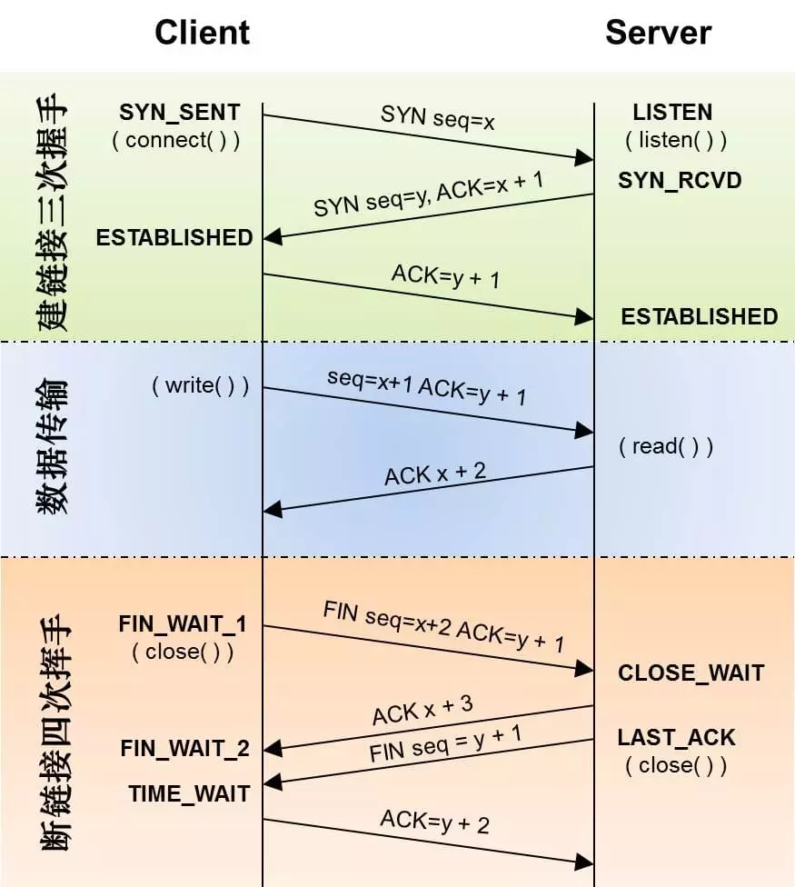
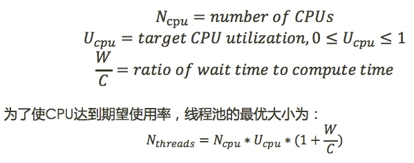
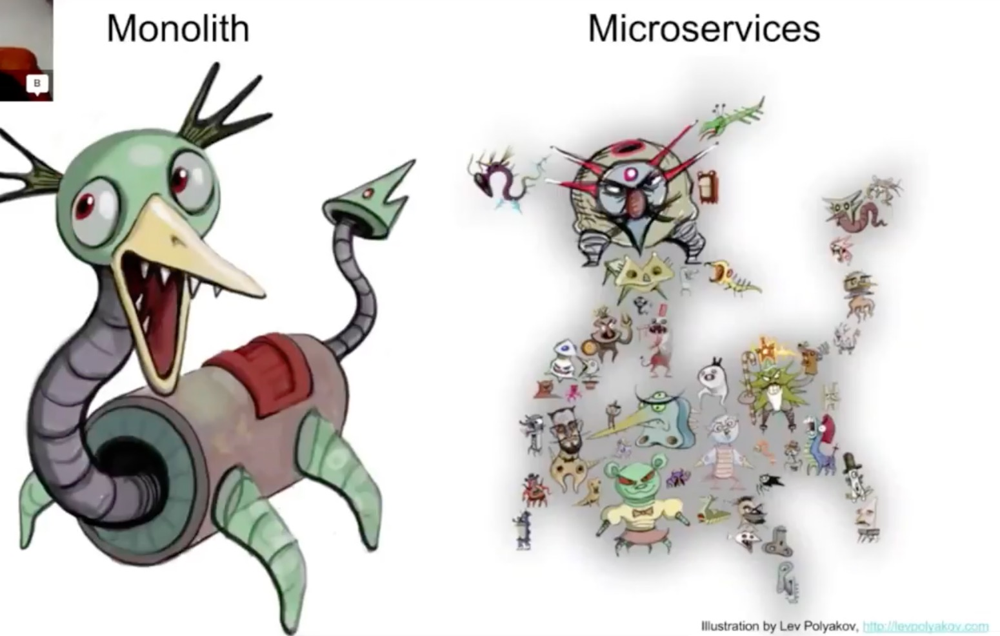
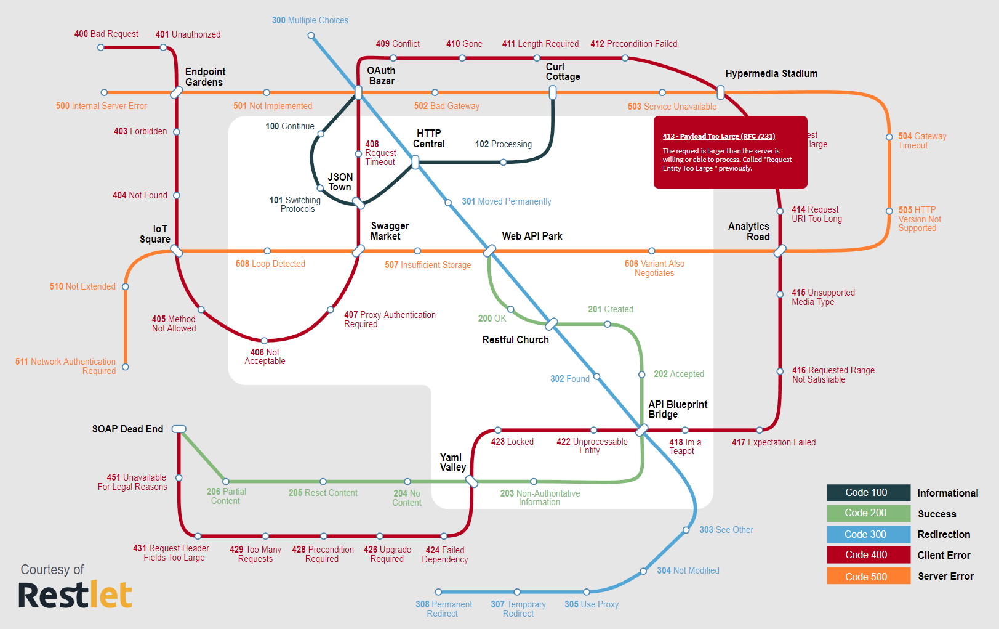
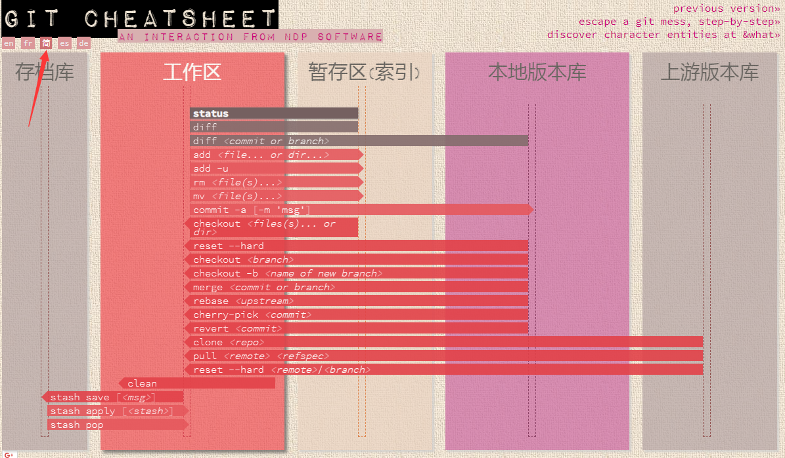

> **注: 如果文章打不开, 可以发 Issues 或者自行 Google 搜索找到新的文章地址, 发 PR. 提前感谢.**

## 一. 收集的文章

#### 1. [日访问量百亿级的应用如何做缓存架构设计](https://blog.didiyun.com/index.php/2018/05/22/weibo-cache/)

> 新浪微博技术专家陈波为大家讲解了**微博 Cache 架构的设计实践过程。**

#### 2. [微服务系统之认证管理详解](https://mp.weixin.qq.com/s/PRSbOYVX-aBmp7S_0qYeuQ)

> 微服务大行其道，微服务安全也是非常热门的话题。本文向大家分享微服务系统中认证管理相关技术。其中包括用户认证、网关和 API 认证、系统间和系统内的认证，以及我们的统一认证管理系统 IAM。

#### 3. [10 分钟理解什么是 OAuth 2.0 协议](https://deepzz.com/post/what-is-oauth2-protocol.html)

> OAuth 2.0 是一个行业的标准授权协议。OAuth 2.0 专注于简化客户端开发人员，同时为 Web 应用程序，桌面应用程序，手机和客厅设备提供特定的授权流程。
>
> 它的最终目的是为第三方应用颁发一个有时效性的令牌 token。使得第三方应用能够通过该令牌获取相关的资源。常见的场景就是：第三方登录。当你想要登录某个论坛，但没有账号，而这个论坛接入了如 QQ、Facebook 等登录功能，在你使用 QQ 登录的过程中就使用的 OAuth 2.0 协议。

#### 4. [Go 空死循环导致的调度器无法调度](https://rakyll.org/scheduler/)

```golang
package main

import (
	"log"
	"runtime"
	// "time"
)

func main() {
	runtime.GOMAXPROCS(4)
	ch := make(chan bool)

	go func() {
		for {
			ch <- true
			log.Println("sent")
		}
	}()

	go func() {
		for {
			re := <-ch
			log.Println("received:", re)
		}
	}()

	// 运行一段时间会卡死
	for {
		// log.Println("=========Deadloop========")
		// time.Sleep(time.Second)
	}
}
```

还可参考:

- [https://gocn.vip/question/2116](https://gocn.vip/question/2116)
- [https://github.com/golang/go/issues/15442](https://github.com/golang/go/issues/15442)

#### 5. [一篇好 TM 长的关于配置中心的文章](http://jm.taobao.org/2016/09/28/an-article-about-config-center/)

> 讲述了配置中心出现的必然, 论证了大型分布式系统是必须配置中心的, 并且配置中心需要有导入导出功能, 以及配置中心和注册中心的区别.

#### 6. [如何实现靠谱的分布式锁？](https://mp.weixin.qq.com/s?__biz=MzIwMzg1ODcwMw==&mid=2247488347&idx=1&sn=057fb356decaf3cbf703d7ab600f8d3b&chksm=96c9a53ba1be2c2d7a530ef02bcd9eb1f1bef91c29473abecab8e568a065882961e6210d6307&mpshare=1&scene=1&srcid=0825XVuWFKkAvRpbtak3o8oV#rd)

> 分布式锁，是用来控制分布式系统中互斥访问共享资源的一种手段，从而避免并行导致的结果不可控。基本的实现原理和单进程锁是一致的，通过一个共享标识来确定唯一性，对共享标识进行修改时能够保证原子性和和对锁服务调用方的可见性。由于分布式环境需要考虑各种异常因素，为实现一个靠谱的分布式锁服务引入了一定的复杂度。

#### 7. [什么是缓存击穿](http://blog.jobbole.com/114012/)

> 如果黑客每次故意查询一个在缓存内必然不存在的数据，导致每次请求都要去存储层去查询，这样缓存就失去了意义。如果在大流量下数据库可能挂掉。这就是缓存击穿。

#### 8. [Dapper: 大规模分布式系统的跟踪系统](https://bigbully.github.io/Dapper-translation/)

> Dapper--Google 生产环境下的分布式跟踪系统，应运而生。那么我们就来介绍一个大规模集群的跟踪系统，它是如何满足一个低损耗、应用透明的、大范围部署这三个需求的

#### 9. [常见性能优化策略的总结](https://tech.meituan.com/performance_tunning.html)

> 数据库， 缓存， 异步处理， NoSQL， 多线程， 分布式， 度量系统， 优化还涉及前端、分布式文件系统、CDN、全文索引、空间索引等几方面。

#### 10. [前端遇上 Go: 静态资源增量更新的新实践](https://tech.meituan.com/fe_and_golang.html)

> 在我们的新实践中，都有哪些大家可以真正借鉴的点：
>
> 1. 不同的语言和工具有不同的用武之地，不要试图用锤子去锯木头。该换语言就换，不要想着一个语言或工具解决一切。
> 2. 更换语言是一个重要的决定，在决定之前首先需要思考是否应当这么做。
> 3. 语言解决更多的是局部问题，架构解决更多的是系统问题。换了语言也不代表就万事大吉了。
> 4. 构建一个系统时，首先思考它是如何垮的。想清楚你的系统潜在瓶颈会出现在哪，如何加强它，如何考虑它的备用方案。

#### 11. [Redis 高负载下的中断优化](https://tech.meituan.com/Redis_High_Concurrency_Optimization.html)

> 原本稳定的环境也因为请求量的上涨带来了很多不稳定的因素，其中一直困扰我们的就是网卡丢包问题。起初线上存在部分 Redis 节点还在使用千兆网卡的老旧服务器，而缓存服务往往需要承载极高的查询量，并要求毫秒级的响应速度，如此一来千兆网卡很快就出现了瓶颈。经过整治，我们将千兆网卡服务器替换为了万兆网卡服务器，本以为可以高枕无忧，但是没想到，在业务高峰时段，机器也竟然出现了丢包问题，而此时网卡带宽使用还远远没有达到瓶颈。

#### 12. [境外业务性能优化实践](https://tech.meituan.com/Overseas_%20business_performance%20_optimization_%20practice.html)

> 如何提升产品性能，做到像国内业务一样，其中面临了很多的技术挑战。本文将从网络优化、前端优化、后端优化几个方面来介绍境外业务在性能优化方面的做过的一些事情。

#### 13. [云设计模式](https://iambowen.gitbooks.io/cloud-design-pattern/content/cloud-design-patterns.html)

> 本书提到的设计模式对于在云中构建可靠，可扩展，安全的应用程序非常有用。 书中的每个模式描述了要解决的问题，使用模式的注意事项主要基于 Microsoft Azure 的例子。大多数模式包含如何在 Azure 上实现模式的代码示例或代码段。大多数模式都适用于分布式系统，具有普适性，和在那个云平台托管没有关系。
>
> 查找 sidechar 模式时发现的。。。我好像发现了新的世界。。。这其实是一本书。

#### 14. [Haunt - Youzan 服务发现 概述](https://tech.youzan.com/haunt-youzan-service-discovery/)

> Haunt 是有赞内部使用的服务发现系统，文中会详细介绍一下该系统的设计与思考  
> PaaS 平台中的应用一般都有多个实例，实例故障重启透明化与负载均衡都与服务发现密切相关。通过服务发现机制，可以透明的对多个实例进行访问，并实现负载均衡。而且应用的某个实例随时都可能故障重启，这时就需要动态配置服务调用方的路由信息。服务发现就可以解决这个动态配置的问题，Haunt(Youzan 服务发现系统)也应运而生。

#### 15. [聊聊微服务的服务注册与发现](http://jm.taobao.org/2018/06/26/%E8%81%8A%E8%81%8A%E5%BE%AE%E6%9C%8D%E5%8A%A1%E7%9A%84%E6%9C%8D%E5%8A%A1%E6%B3%A8%E5%86%8C%E4%B8%8E%E5%8F%91%E7%8E%B0/)

> 聊起微服务的服务注册与发现，很多人立马就会脱口而出 zk、etcd、consul、eureka 这些组件，进而聊到 CAP 如何取舍，性能如何，高可用和容灾是怎么实现的。  
> 在这之前，站在组件使用者的角度，我想先问这么几个问题:
>
> - 注册的 IP 和端口怎么确定 ？
> - 实现服务治理还需要注册哪些信息 ？
> - 如何进行优雅的服务注册与服务下线 ？
> - 注册服务的健康检查是如何做的 ？
> - 当服务有节点退出或新的节点加入时，订阅者能不能及时收到通知 ?
> - 我能方便地查看某个应用发布和订阅了哪些服务，以及所订阅的服务有哪些节点吗 ？

#### 16. [异步消息传递技术的比较：JMS、AMQP 和 MQTT](https://blog.csdn.net/happytofly/article/details/80123057)

> 消息传递作为基本通信机制已经在全世界成功运用。无论是人与人、机器与人还是机器与机器之间，消息传递一直都是唯一常用的通信方式。在双方（或更多）之间交换消息有两种基本机制。
>
> - 同步消息传递
> - 异步消息传递  
>   同步消息传递在这种情况下使用，当消息发送者希望在某个时间范围内收到响应，然后再进行下一个任务。基本上就是他在收到响应前一直处于“阻塞”状态。  
>   异步消息意味着发送者并不要求立即收到响应，而且也不会阻塞整个流程。响应可有可无，发送者总会执行剩下的任务。
>   上面提到的技术，当两台计算机上的程序相互通信的时候，就广泛使用了异步消息传递。随着微服务架构的兴起，很明显我们需要使用异步消息传递模型来构建服务。

#### 17. [微服务架构 为什么需要配置中心](https://www.cnblogs.com/davidwang456/articles/9238281.html)

> 在系统架构中，和安全、日志、监控等非功能需求一样，配置管理也是一种非功能需求。  
> 配置中心是整个微服务基础架构体系中的一个组件，如下图，它的功能看上去并不起眼，无非就是简单配置的管理和存取，但它是整个微服务架构中不可或缺的一环。  
> 另外，配置中心如果真得用好了，它还能推动技术组织持续交付和 DevOps 文化转型。

#### 18. [关于 TCP 半连接队列和全连接队列](http://jm.taobao.org/2017/05/25/525-1/)

> 全连接队列、半连接队列溢出这种问题很容易被忽视，但是又很关键，特别是对于一些短连接应用（比如 Nginx、PHP，当然他们也是支持长连接的）更容易爆发。  
> 一旦溢出，从 cpu、线程状态看起来都比较正常，但是压力上不去，在 client 看来 rt 也比较高（rt=网络+排队+真正服务时间），但是从 server 日志记录的真正服务时间来看 rt 又很短。  
> 希望通过本文能够帮大家理解 TCP 连接过程中的半连接队列和全连接队列的概念、原理和作用，更关键的是有哪些指标可以明确看到这些问题。

#### 19. [AI 时代的全链路监控，阿里工程师怎么做？](https://mp.weixin.qq.com/s/DJhJKD4TCDgSwyLZbSotKg)

> 全链路监控从业务的视角出发，监控整个业务流程的健康状况，无需多个系统切换，直观看到全局和上下游，方便快速发现、定位问题。今天，我们一起来看看阿里基础设施技术团队在这方面的实践经验。

#### 20. [10+倍性能提升全过程--优酷账号绑定淘宝账号的 TPS 从 500 到 5400 的优化历程](http://jm.taobao.org/2017/05/04/20170504/)

> 主要的问题和优化过程如下：
>
> - docker bridge 网络性能问题和网络中断 si 不均衡 （优化后：500->1000TPS)
> - 短连接导致的 local port 不够 （优化后：1000-3000TPS）
> - 生产环境 snat 单核导致的网络延时增大 （优化后能达到测试环境的 3000TPS）
> - Spring MVC Path 带来的过高的 CPU 消耗 （优化后：3000->4200TPS)
> - 其他业务代码的优化（比如异常、agent 等） （优化后：4200->5400TPS)

#### 21. [有赞统一日志平台初探](https://tech.youzan.com/you-zan-tong-ri-zhi-ping-tai-chu-tan/)

> 有赞统一日志系统，负责收集所有系统日志和业务日志，转化为流式数据，通过 flume 或 logstash 上传到日志中心(kafka 集群)，  
> 然后供 Track、Storm、Spark 及其它系统实时分析处理日志，并将日志持久化存储到 HDFS 供离线数据分析处理，或写入 ElasticSearch 提供数据查询，
> 或写入 Hawk 发起异常报警或提供指标监控查询。

#### 22. ["微" 害架构](https://zhuanlan.zhihu.com/p/43291161)

> “微” 害架构，即微架构以不合理的方式运行着，其表现形式不适当地采用 “微架构”（微服务、APP 插件化、微前端等）技术拆分臃肿的单体应用，导致软件架构进一步复杂化、难以维护，使得原本具有优势的微架构微微出现一些问题。
> 为什么一个设计良好的架构，会变成一个人人嫌弃的架构？我们可以轻轻松松地列举出这么一些理由:
>
> - 架构的设计不符合演进的需求。
> - 开始设计时，架构就不合理。
> - 架构本身是合理的，后继的开发者能力不足。
> - 架构本身是合理的，然而开发的过程中走歪了。
>
> 关于能力不足导致的架构问题，就不进一步展开讨论。我们主要讨论的是 “走歪了的流程”，它才是导致 "微" 害架构的元凶。在开发能力完备的情况下，架构走向微微不合理的地方，有一个原因是：KPI。KPI 导向的系统架构设计，必然会出现一定的不合理性。

#### 23. [架构专家详解深入浅出分布式缓存的通用方法](https://mp.weixin.qq.com/s/DNraZpi_00MeDw7fTjgJlQ)

> 笔者所在的多家互联网公司大量使用了缓存，对分布式缓存的应用可谓遍地开花；  
> 笔者曾供职的一家社交媒体网站，号称是世界上使用缓存最多的公司。  
> 毋庸置疑，缓存帮助我们解决了很多性能问题，甚至帮助我们解决了一些并发问题。

#### 24. [分布式中"一致性"这个词的各项含义](https://www.zhihu.com/question/275845393)

> 分布式事务的一致性，raft 共识算法的一致性，一致性哈希的一致性，这些"一致性"的区别，以下回答会让你更加清楚。

#### 25. [无锁环形队列 Go 语言实现](https://zhuanlan.zhihu.com/p/30329184)

> 可以用来做延迟消息队列

#### 26. [有赞延迟队列设计](https://tech.youzan.com/queuing_delay/)

> 我们先看看以下业务场景：
>
> - 当订单一直处于未支付状态时，如何及时的关闭订单，并退还库存？
> - 如何定期检查处于退款状态的订单是否已经退款成功？
> - 新创建店铺，N 天内没有上传商品，系统如何知道该信息，并发送激活短信？等等
>
> 为了解决以上问题，最简单直接的办法就是定时去扫表。每个业务都要维护一个自己的扫表逻辑。 当业务越来越多时，我们会发现扫表部分的逻辑会非常类似。我们可以考虑将这部分逻辑从具体的业务逻辑里面抽出来，变成一个公共的部分。
>
> 设计目标:
>
> - 消息传输可靠性：消息进入到延迟队列后，保证至少被消费一次。
> - Client 支持丰富：由于业务上的需求，至少支持 PHP 和 Python。
> - 高可用性：至少得支持多实例部署。挂掉一个实例后，还有后备实例继续提供服务。
> - 实时性：允许存在一定的时间误差。
> - 支持消息删除：业务使用方，可以随时删除指定消息。

#### 27. ["分布式事务一致性" 看这一篇就够了](https://mp.weixin.qq.com/s/_zMzWRYy0TZkxQKDI5sDXA)

> 主要内容包括 4 部分：
>
> - 传统分布式事务不是微服务中一致性的最佳选择
> - 微服务架构中应满足数据最终一致性原则
> - 微服务架构实现最终一致性的三种模式
> - 对账是最后的终极防线。

#### 28. [缓存架构，一篇足够？](https://mp.weixin.qq.com/s?__biz=MjM5ODYxMDA5OQ==&mid=2651961368&idx=1&sn=82a59f41332e11a29c5759248bc1ba17&chksm=bd2d0dc48a5a84d293f5999760b994cee9b7e20e240c04d0ed442e139f84ebacf608d51f4342&scene=21#wechat_redirect)

> 一个集锦, 各种方案, 美滋滋

#### 29. [数据库索引，到底是什么做的？](https://mp.weixin.qq.com/s/YMbRJwyjutGMD1KpI_fS0A)

> 数据库索引用于加速查询, 虽然哈希索引是 O(1)，树索引是 O(log(n))，但 SQL 有很多“有序”需求，故数据库使用树型索引
>
> - InnoDB 不支持哈希索引
> - 数据预读的思路是：磁盘读写并不是按需读取，而是按页预读，一次会读一页的数据，每次加载更多的数据，以便未来减少磁盘 IO
> - 局部性原理：软件设计要尽量遵循“数据读取集中”与“使用到一个数据，大概率会使用其附近的数据”，这样磁盘预读能充分提高磁盘 IO
> - 数据库的索引最常用 B+树：
>   > - (1)很适合磁盘存储，能够充分利用局部性原理，磁盘预读；
>   > - (2)很低的树高度，能够存储大量数据；
>   > - (3)索引本身占用的内存很小；
>   > - (4)能够很好的支持单点查询，范围查询，有序性查询；

#### 30. [大众点评订单系统分库分表实践](https://tech.meituan.com/dianping_order_db_sharding.html)

> 原大众点评的订单单表早就已经突破两百 G，由于查询维度较多，即使加了两个从库，优化索引，仍然存在很多查询不理想的情况。
> 去年大量抢购活动的开展，使数据库达到瓶颈，应用只能通过限速、异步队列等对其进行保护；
> 业务需求层出不穷，原有的订单模型很难满足业务需求，但是基于原订单表的 DDL 又非常吃力，无法达到业务要求。
> 随着这些问题越来越突出，订单数据库的切分就愈发急迫了。
> 这次切分，我们的目标是未来十年内不需要担心订单容量的问题。

#### 31. [Google 云 API 设计手册](https://github.com/ch3rub1m/api-design-guide)

> 这是一份针对网络 API 的通用设计指南。它从 2014 年开始用于 Google 内部，也用于设计 Cloud APIs 和 Google APIs。
> 这份指南在此处共享来告知外部开发者，以便我们所有人都能更轻松地合作。
> Google Cloud Endpoints 的开发者们可能会发现这份指南在设计 gRPC APIs 的时候特别有用，并且我们强烈推荐这些开发者们使用这些设计准则。
> 但是我们并不强迫你使用它。你也可以使用 Cloud Endpoints 和 gRPC 却不遵循这份指南。
> 这份指导可同时应用于基于 HTTP 的 REST APIs 与基于 socket 的 RPC APIs，尤其是 gRPC APIs。
> gRPC APIs 使用 Protocol Buffers 来定义它们的 API 接口，使用 API Service Configuration 来定义他们的 API 服务，包括 HTTP 映射，日志和监控。
> HTTP 映射这个特性被 Google APIs 和 Cloud Endpoints gRPC APIs 使用，用于 JSON/HTTP 和 Protocol Buffers/RPC 之间的转码。

#### 32. [Kubernetes & Microservice](https://github.com/ch3rub1m/api-design-guide)

> 本质上，微服务的目的是想以一种架构模式，应对软件所服务的用户的规模增长。没有微服务架构之前，大多数应用是以单体模式出现的，只有当规模增长到一定程度，单体架构满足不了伸缩的需求的时候，才考虑拆分。而微服务的目标是在一开始的时候就按照这种架构实现，是一种面向未来的架构，也就是说用开始的选择成本降低以后的重构成本。用经济学的观点来说，微服务是技术投资，单体应用是技术债务，技术有余力那可以投资以期待未来收益，没余力那就只能借债支持当前业务，等待未来还债。而随着微服务基础设施的越来越完善，用很小的投资就可以获得未来很大的收益，就没有理由拒绝微服务了。

#### 33. [论数据库容器化的目标和价值](http://jolestar.com/the-containerized-value-of-database/)

> 总结下，对技术的接纳很多情况下其实是纯粹的观念问题。最初 IaaS 出来的时候，不也有很多人说，数据库服务不适合跑在虚拟机上了，大数据服务不适合跑在虚拟机上了，现在不也有很多用户用的很好。
> 合适不合适，脱离具体的业务场景和需求，是说不清楚的，对于大多数用户和产品来说，数据库的易用性，易维护性，可用性，要大于性能等其他方面的要求的，对另外一部分用户来说，数据库肯定要跑到物理机上，甚至 PC 服务器都不能满足。
> 所以还是不要仅仅从自己的当前的业务需求来断定一个技术通用价值。
> 技术人喜欢仅仅从自己的角度去进行价值判断，我个人也是这样。最近也在反思，技术人要突破，无论是创业，还是设计对客户有价值的产品，都需要把视角放宽一些，谨以此文与各位共勉。

#### 34. [通过 Kubernetes 学架构](http://jolestar.com/learning-architecture-by-kubernetes/)

> 基础研发领域，Kubernetes 的架构有非常多的借鉴之处。一方面它的许多设计是 Google 内部多年积累的最佳实践的沉淀，是 Borg，Omega 演进的结果。
> 另外一方面，它是一个综合的系统工程，不是一个单纯的技术工程。系统工程的特点是任何一部分单独抽取出来，貌似都没有太高的技术含量，
> 但它的复杂度在于如何让各个子系统优雅的结合在一起，对外表现出统一的设计思想，而不是堆砌和拼凑，如何设计对用户更友好，如何设计更利于扩展。
> 这也意味着，它的许多设计和选择没有最优解，是一种优劣权衡的结果。而我们设计的大多数系统，都是这类型的系统，所以更值得借鉴。

#### 35. [基于 Go 的 RPC 框架实践-新浪微博](https://mp.weixin.qq.com/s/qZ_p4jLKCwHUx2IGsx217Q)

> 这是今年年初春节的时候，一个网友的故事，在 QQ 群里面分享的一个真实的励志故事。
> 这是一位游戏开发界知名的网友，现在在一家香港公司主要做海外游戏的项目，他们面临一个问题：他们部署了很多游戏服务器，但是当大家登录的时候会有一些恶意的攻击，
> 他要拦截相关所有的操作把日志发到一个集群里面，存到数据库做分析。 一开始用 Java 去做，然后出现诸多的问题，性能也非常低下，
> 在去年的时候，他们用了 rpcx2.0 框架去做了改造，这是改造完运行半年的数据一张数据截图，应该是不到一天的统计量，有 32 亿的请求量。
> 年终的时候他们老板算了一下，通过这次改造减少了一半的服务器的数量，费用从一个月 100 万港元减少到 50 万港元租赁服务器带宽等等费用，这给公司的运行成本带来不少好处，
> 也给开发和运维人员带来了非常大的便利。我觉得它是非常好、典型的例子，它在半年的运营过程中，没有发现一个问题，非常稳定。
> 只有一个问题是其中一个路由器坏了闪断了一下，但是和我们的软件没有任何关系。

#### 36. [RPCX: 一个用 Go 实现的类似 Dubbo 的分布式 RPC 框架](https://colobu.com/2016/05/26/RPCX-a-distributed-rpc-dubbo-like-framework-by-Go/)

[文档地址](http://doc.rpcx.site/)

> rpcx 使用 Go 实现，适合使用 Go 语言实现 RPC 的功能:
>
> - 基于 net/rpc,可以将 net/rpc 实现的 RPC 项目轻松的转换为分布式的 RPC
> - 插件式设计，可以配置所需的插件，比如服务发现、日志、统计分析等
> - 基于 TCP 长连接,只需很小的额外的消息头
> - 支持多种编解码协议，如 Gob、Json、MessagePack、gencode、ProtoBuf 等
> - 服务发现：服务发布、订阅、通知等，支持多种发现方式如 ZooKeeper、Etcd 等
> - 高可用策略：失败重试（Failover）、快速失败（Failfast）
> - 负载均衡：支持随机请求、轮询、低并发优先、一致性 Hash 等
> - 规模可扩展，可以根据性能的需求增减服务器
> - 其他：调用统计、访问日志等
>
> rpcx 目标是轻量级的，小而简单，但是期望所有的功能都可以通过插件的方式搭积木的方式完成。

#### 37. [Concurrency in go](https://www.kancloud.cn/mutouzhang/go/596804)

> Go 是门很棒的语言。当它首次被宣告给这个世界时，所包含的特性令人疯狂：
> 语法简洁，编译速度非常快，执行效率高，支持鸭子类型，用它的并发原语处理问题非常直观。
> 在第一次使用 go 关键字建立 goroutine 时(这就是本书将要介绍的东西)，我太高兴了，与其他多种语言相比，我从未有过如此爽快的感觉。

#### 38. [七周七并发模型.pdf](https://github.com/threerocks/studyFiles/blob/master/go/%E4%B8%83%E5%91%A8%E4%B8%83%E5%B9%B6%E5%8F%91%E6%A8%A1%E5%9E%8B.pdf)

> 《七周七并发模型》是介绍并发模型的好书，值得一读。
> 许多开发者搞了好多年开发，对并发模型却只知道多进程和多线程这两种。这本书从最基础的线程和锁模型讲起，介绍了许多非常有用的并发模型：
>
> - 通过无变量的函数式编程实现并发，是无锁并发的一种模型；
> - Clojure 对于状态和标识的分离，可以轻松实现内存事务模型；
> - Erlang 的 Actor 模型是容错性非常高的分布式并发模型；
> - CSP 模型是另一种分布式并发模型，被 Go 和 Clojure 采用；
> - GPU 的并行计算主要针对数据密集型计算的并行，搞游戏的一定要看；
> - Hadoop 和 Storm 分别适合超大数据量的批处理和流式处理。
>
> 其实，无论什么并发模型，归根到底，设计思想就是：
>
> - 数据要不变
> - 数据要不变
> - 数据要不变
>
> 在这个指导思想下实现并发，比传统的多线程+锁容易多了。
> 任何数据，只要保持不变特性，就可以反复执行，因为结果是一样的，这样分布式和容错的实现就简单多了。

#### 39. [一文读懂熔断器和重试机制](https://mp.weixin.qq.com/s/C6gBmwgYGAN7gsF40-JBgQ)

> 随着微服务的流行，熔断作为其中一项很重要的技术也广为人知。
> 当微服务的运行质量低于某个临界值时，启动熔断机制，暂停微服务调用一段时间，以保障后端的微服务不会因为持续过负荷而宕机。
> 本文作者介绍了熔断的原理和机制，并用例子说明了熔断如何使用。

#### 40. [实时接口数据也能就近访问？细说如何用 CDN 提升 App 性能](https://mp.weixin.qq.com/s/O3wHbI1fT9_AlP7Aq_Juog)

> 边缘计算是在靠近物或数据源头的一侧，就近提供计算服务。
> 其应用程序在边缘侧发起，产生更快的网络服务响应，满足行业在实时业务、应用智能、安全与隐私保护等方面的基本需求。
> 本文作者介绍了在 CDN 节点上做实时数据处理的一些方式，值得架构师学习。

#### 41. [高性能的消息框架 go-disruptor](https://colobu.com/2016/07/22/using-go-disruptor/)

> Java 程序员都知道，Disruptor 是一个高性能的线程间通信的框架，即在同一个 JVM 进程中的多线程间消息传递,由 LMAX 开发。
> Disruptor 性能是如此之高，LMAX 利用它可以处理每秒 6 百万订单，用 1 微秒的延迟获得吞吐量为 100K+。那么 Go 语言生态圈中有没有这样的库呢？
> go-disruptor 就是对 Java Disruptor 的移植,它也提供了与 Java Disruptor 类似的 API 设计
> 参考:
>
> 1. [https://github.com/smartystreets/go-disruptor](https://github.com/smartystreets/go-disruptor)
> 2. [https://github.com/LMAX-Exchange/disruptor](https://github.com/LMAX-Exchange/disruptor)

#### 42. [为什么 Disruptor 会那么快?](https://colobu.com/2014/12/22/why-is-disruptor-faster-than-ArrayBlockingQueue/)

> Disruptor 是一个高性能的线程间消息传递的框架。
> LMAX 目标是成为当世最快的商务平台。 为了实现这个目标，LMAX 需要做一些特殊的工作在 Java 平台上取得低延迟和高吞吐率的目标。
> 性能测试表明使用队列(queue)传递数据会带来延迟， 所以 LAMX 对这一块做了非常好的优化。

#### 43. [使用 Ring Buffer 构建高性能的文件写入程序](https://cloud.tencent.com/developer/article/1045110)

> 将多次写入操作合并成一次写入操作，并且采用异步写入方式。要保存多次操作的内容就要有一个类似“队列”的东西来保存，而一般的线程安全的队列，
> 都是“有锁队列”，在性能要求很高的系统中，不希望在日志记录这个地方耗费多一点计算资源，所以最好有一个“无锁队列”，因此最佳方案就是 Ring Buffer（环形缓冲区）了。

#### 44. [记一次失败的 docker 排障经历](http://devopstarter.info/docker-daemon-debug-trip/)

> Okay，闲话不多说，本文即是介绍鄙人最近（2017.06.03）对 docker daemon 无故 hang 住问题的一次排障经历。
> 这一问题其实存在已久，因为没有足够的精力，对 Docker 也不够熟悉（其实还是惰性使然，这种排障投入产出比太低了，
> 所以很多时候倾向于 workaround），因此直到这回才真正深入挖掘了一下，当然，见于标题所述，其实这回也是一次失败的尝试 :(
> 这些方法理论上来说应该是普遍适用的，strace、debug level log、dump、sourcode level debug

#### 45. [5 simple ways to troubleshoot using Strace](http://hokstad.com/5-simple-ways-to-troubleshoot-using-strace)

> Strace is quite simply a tool that traces the execution of system calls. In its simplest form it can trace the execution of a binary from start to end, and output a line of text with the name of the system call, the arguments and the return value for every system call over the lifetime of the process. But it can do a lot more:
>
> - It can filter based on the specific system call or groups of system calls
> - It can profile the use of system calls by tallying up the number of times a specific system call is used, and the time taken, and the number of successes and errors.
> - It traces signals sent to the process.
> - It can attach to any running process by pid.

#### 46. [Configure and troubleshoot the Docker daemon](https://docs.docker.com/config/daemon/)

> After successfully installing and starting Docker, the dockerd daemon runs with its default configuration. This topic shows how to customize the configuration, start the daemon manually, and troubleshoot and debug the daemon if you run into issues.

#### 47. [DHT 分布式哈希表](https://colobu.com/2018/03/26/distributed-hash-table/)

> [https://github.com/arriqaaq/chord](https://github.com/arriqaaq/chord)
> 研究分布式哈希表的主要动机是为了开发点对点系统，像是 Napster、Gnutella、BitTorrent 及 Freenet。
> 这些系统使用分散在互联网上的各项资源以提供文件分享服务，特别在带宽及硬盘存储空间上受益良多。

#### 48. [标准的 Golang 项目工程结构](https://github.com/golang-standards/project-layout)

> This is a basic layout for Go application projects. It's not an official standard defined by the core Go dev team; however, it is a set of common historical and emerging project layout patterns in the Go ecosystem. Some of these patterns are more popular than others. It also has a number of small enhancements along with several supporting directories common to any large enough real world application.
> [GopherCon 2018: Kat Zien - How Do You Structure Your Go Apps](https://www.youtube.com/watch?v=oL6JBUk6tj0)

#### 49. [Diving Deep Into The Golang Channels.](https://codeburst.io/diving-deep-into-the-golang-channels-549fd4ed21a8)

> .........

#### 50. [分布式哈希与一致性哈希](https://www.jianshu.com/p/7beeb52376cc)

> consistent hashing 是一种 hash 算法，简单的说，在移除 / 添加一个 cache 时，它能够尽可能小的改变已存在 key 映射关系。

#### 51. [Graceful upgrades in Go](https://blog.cloudflare.com/graceful-upgrades-in-go/)

> The idea behind graceful upgrades is to swap out the configuration and code of a process while it is running, without anyone noticing it.
> If this sounds error prone, dangerous, undesirable and in general a bad idea – I’m with you.
> However, sometimes you really need them. Usually this happens in an environment where there is no load balancing layer.
> We have these at Cloudflare, which led to us investigating and implementing various solutions to this problem.

#### 52. [Doing Well by Doing Bad: Writing Bad Code with Go](https://medium.com/capital-one-tech/doing-well-by-doing-bad-writing-bad-code-with-go-part-1-2dbb96ce079a)

> [Doing Well by Doing Bad: Writing Bad Code with Go Part 2](https://medium.com/capital-one-tech/doing-well-by-doing-bad-writing-bad-code-with-go-part-2-e270d305c9f7)
> As a quick review, the evil Go tricks we covered include:
>
> - Poorly named and organized packages.
> - Incorrectly organized interfaces.
> - Passing pointers to variables into functions to populate their values.
> - Using panics instead of errors.
> - Using init functions and blank imports to set up dependencies.
> - Loading configuration files using init functions.
> - Using frameworks instead of libraries.

#### 53. [层级时间轮的 Golang 实现](http://russellluo.com/2018/10/golang-implementation-of-hierarchical-timing-wheels.html)

> 源码: [https://github.com/RussellLuo/timingwheel](https://github.com/RussellLuo/timingwheel)
>
> 其实在软件系统中，“在一段时间后执行一个任务” 的需求比比皆是。比如：
>
> - 客户端发起 HTTP 请求后，如果在指定时间内没有收到服务器的响应，则自动断开连接。
>
> 为了实现上述功能，通常我们会使用定时器 Timer：
>
> - 客户端发起请求后，立即创建（启动）一个 Timer：到期间隔为 d，到期后执行 “断开连接” 的操作。
> - 如果到期间隔 d 以内收到了服务器的响应，客户端就删除（停止）这个 Timer。
> - 如果一直没有收到响应，则 Timer 最终会到期，然后执行 “断开连接” 的操作。
>
> Golang 内置的 Timer 是采用最小堆来实现的，创建和删除的时间复杂度都为 O(log n)。现代的 Web 服务动辄管理 10w+ 甚至 100w+ 的连接，每个连接都会有很多超时任务（比如发送超时、心跳检测等），如果每个超时任务都对应一个 Timer，性能会十分低下。

#### 54. [一个 Go 程序系统线程暴涨的问题](https://zhuanlan.zhihu.com/p/22474724)

> 最近 fix 了一个 Go 程序系统线程数量暴增的问题，线程数量维持在 2，3 万个，有时候甚至更多，这情况明显不符合 Go 的并发原理。
> 第一次发现线程数巨多是因为这个程序突然 crash 了，由于设置了程序可用的最大线程数，所以线程数一太多就会 crash。
> 这个程序其实就是现在挺火热的 Swarm，Swarm 这个程序的模式就是作为 client 的角色向数万个 docker daemon 服务器建连，维持长连接状态，
> 然后再定时的从这些 docker daemon 读取数据。经排查，发现长连接数和线程数基本一致，看到这个现象完全不能够理解。

#### 55. [Go 调度器跟踪](https://colobu.com/2016/04/19/Scheduler-Tracing-In-Go/)

> 我喜欢 Go 的原因之一就是能够产生概要(profiling)和调试信息。当你的程序运行时，GODEBUG 环境变量可以产生运行时的调试信息。
> 你可以请求垃圾回收器和调度器(scheduler)的摘要信息和细节。关键是你不需要额外创建单独的编译程序就可以实现。
> 在本文中，我将演示如何理解一个简单的并发 Go 程序的调度器跟踪信息。如果你已经有 Go 调度器的基本概念，对阅读本文会很有帮助

#### 56. [饿了么异地多活技术实现（一）总体介绍](https://zhuanlan.zhihu.com/p/32009822)

> 饿了么要做多活，是受业务发展的驱动，经过几年的高速发展，我们的业务已经扩大到单个数据中心撑不住了，主要机房已经不能再加机器，业务却不断的要求加扩容，
> 所以我们需要一个方案能够把服务器部署到多个机房。另外一个更重要的原因是，整个机房级别的故障时有发生，每次都会带来严重的后果，我们需要在发生故障时，
> 能够把一个机房的业务全部迁移到别的机房，保证服务可用。

#### 57. [浅谈代码的执行效率(1):算法是关键](http://www.cnblogs.com/JeffreyZhao/archive/2010/01/07/short-code-is-not-always-fast-1-algorithms.html)

> 最重要的是，没有 Profiling，一切优化都是徒劳的。如果您认为减少赋值和判断可以有效提高性能，那么也用 Profiling 来证明一下，不是吗？
> 当然，我并没有说一些细节上的调整对性能影响不大，我接下来也会讨论直接对汇编进行的优化。但是，即使我们有需要优化汇编的场景……它们基本上也不是靠所谓减少赋值和判断来起到效果的。
> 最后补充一句：这篇文章里我谈到的“算法”是指广义的“实现方式”，通俗地讲便是“代码的写法”。而“冒泡排序”等面向指定问题的解法，我把它称之为“经典算法”。在这里，我们还是加以区分吧。

#### 58. [浅谈代码的执行效率（2）：编译器的威力](http://www.cnblogs.com/JeffreyZhao/archive/2010/01/08/talk-about-code-performance-2-compiler.html)

> 我列举这个例子也不是为了说明 C/C++的性能不够好，我这里谈的一切都是想说明一个问题：代码的执行效率并非能从字面上得出结论，更不是“简短”两个字能说明问题的。
> 少一些赋值，少一些判断并非提高性能的正确做法，甚至您的手动优化会让编译器无法理解您的意图，进而无法进行有效的优化。
> 如果您真想在细节上进行优化，还是进行 Profiling 之后，针对热点进行有效地优化吧。
> Profiling，Profiling，Profiling。

#### 59. [浅谈代码的执行效率（3）：缓存与局部性](http://www.cnblogs.com/JeffreyZhao/archive/2010/01/12/talk-about-code-performance-3-locality.html)

> 在前两篇文章里，我们讨论了程序性能的两个方面，一是算法（广义的算法，即解决问题的方法），二是编译器。通过这两个方面，我想表达的意思是，一段程序的执行效率，
> 是很难从表面现象得出结论的，至少从一些简单的层面，如代码的长度是几乎难以说明任何问题——因此一定要进行 Profiling 才能做到有效的优化。
> 而现在，我们假设两段程序算法基本相同，编译器也只是进行简单的“翻译”，那么……我们能从“表面”看出性能高下吗？

#### 60. [浅谈代码的执行效率（4）：汇编优化](http://www.cnblogs.com/JeffreyZhao/archive/2010/01/14/talk-about-code-performance-4-asm-optimization.html)

> 终于谈到这个话题了，首先声明我不是汇编优化的高手，甚至于我知道的所有关于汇编优化的内容，仅仅来自于学校的课程、书本及当年做过的一些简单练习。
> 换句话说，我了解的东西只能算是一些原则，甚至也有一些“陈旧”了——不过我想既然是一些原则性的东西，还是能够用它来做一定程度的判断。至少我认为，
> 我在博客园里看到的许多关于“汇编优化”也好，“内嵌汇编”也罢的说法，经常是有些问题的。

## 二. 收集的仓库

#### 1. [Go 夜读群的总结分享](https://github.com/developer-learning/night-reading-go)

> 好多文章和仓库, 都是从这个群交流后收集的, 感谢分享, 感谢开源.

#### 2. [系统设计技能树](https://github.com/donnemartin/system-design-primer/blob/master/README-zh-Hans.md)

> 系统设计相关, 感觉是架构师, 系统工程师必备的技能树

#### 3. [Codis: Proxy based Redis cluster solution supporting pipeline and scaling dynamically](https://github.com/CodisLabs/codis)

> Codis 是一个分布式 Redis 解决方案, 对于上层的应用来说, 连接到 Codis Proxy 和连接原生的 Redis Server 没有显著区别 (不支持的命令列表), 上层应用可以像使用单机的 Redis 一样使用, Codis 底层会处理请求的转发, 不停机的数据迁移等工作, 所有后边的一切事情, 对于前面的客户端来说是透明的, 可以简单的认为后边连接的是一个内存无限大的 Redis 服务。

#### 4. [Pika: is a nosql compatible with redis, it is developed by Qihoo's DBA and infrastructure team](https://github.com/Qihoo360/pika)

> Pika 是一个可持久化的大容量 redis 存储服务，兼容 string、hash、list、zset、set 的绝大部分接口(兼容详情)，解决 redis 由于存储数据量巨大而导致内存不够用的容量瓶颈，并且可以像 redis 一样，通过 slaveof 命令进行主从备份，支持全同步和部分同步，pika 还可以用在 twemproxy 或者 codis 中来实现静态数据分片

#### 5. [Qconf: Qihoo Distributed Configuration Management System](https://github.com/Qihoo360/QConf)

> QConf 是一个分布式配置管理工具。 用来替代传统的配置文件，使得配置信息和程序代码分离，同时配置变化能够实时同步到客户端，而且保证用户高效读取配置，这使的工程师从琐碎的配置修改、代码提交、配置上线流程中解放出来，极大地简化了配置管理工作。

#### 6. [Beats - Lightweight shippers for Elasticsearch & Logstash](https://github.com/elastic/beats)

> 基于 Golang 的轻量级日志采集软件, 包括: 文件, 流量等等...

#### 7. [Jaeger - a Distributed Tracing System](https://github.com/jaegertracing/jaeger)

> It can be used for monitoring microservices-based distributed systems:
>
> - Distributed context propagation
> - Distributed transaction monitoring
> - Root cause analysis
> - Service dependency analysis
> - Performance / latency optimization

#### 8. [ Pholcus is a distributed, high concurrency and powerful web crawler software.](https://github.com/henrylee2cn/pholcus)

> 1. 为具备一定 Go 或 JS 编程基础的用户提供只需关注规则定制、功能完备的重量级爬虫工具；
> 2. 支持单机、服务端、客户端三种运行模式；
> 3. GUI(Windows)、Web、Cmd 三种操作界面，可通过参数控制打开方式；
> 4. 支持状态控制，如暂停、恢复、停止等；
> 5. 可控制采集量；
> 6. 可控制并发协程数；
> 7. 支持多采集任务并发执行；
> 8. 支持代理 IP 列表，可控制更换频率；
> 9. 支持采集过程随机停歇，模拟人工行为；
> 10. 根据规则需求，提供自定义配置输入接口
> 11. 有 mysql、mongodb、kafka、csv、excel、原文件下载共五种输出方式；
> 12. 支持分批输出，且每批数量可控；
> 13. 支持静态 Go 和动态 JS 两种采集规则，支持横纵向两种抓取模式，且有大量 Demo；
> 14. 持久化成功记录，便于自动去重；
> 15. 序列化失败请求，支持反序列化自动重载处理；
> 16. 采用 surfer 高并发下载器，支持 GET/POST/HEAD 方法及 http/https 协议，同时支持固定 UserAgent 自动保存 cookie 与随机大量 UserAgent 禁用 cookie 两种模式，高度模拟浏览器行为，可实现模拟登录等功能；
> 17. 服务器/客户端模式采用 Teleport 高并发 SocketAPI 框架，全双工长连接通信，内部数据传输格式为 JSON。

#### 9. [Colly: Elegant Scraper and Crawler Framework for Golang](https://github.com/gocolly/colly)

> Features:
>
> - Clean API
> - Fast (>1k request/sec on a single core)
> - Manages request delays and maximum concurrency per domain
> - Automatic cookie and session handling
> - Sync/async/parallel scraping
> - Caching
> - Automatic encoding of non-unicode responses
> - Robots.txt support
> - Distributed scraping
> - Configuration via environment variables
> - Extensions

#### 10. [yulong-hids: 一款由 YSRC 开源的主机入侵检测系统](https://github.com/ysrc/yulong-hids)

> - 实时监控、秒级响应
> - 全局首次出现概念，可发现未知威胁
> - 支持自定义规则，高扩展性
> - 高级分析功能，可溯源
> - 全局快速阻断（进程、文件）
> - 威胁情报查询（可自定义接口）

#### 11. [YApi 是一个可本地部署的、打通前后端及 QA 的、可视化的接口管理平台](https://github.com/YMFE/yapi)

> ### 特性
>
> - 基于 Json5 和 Mockjs 定义接口返回数据的结构和文档，效率提升多倍
> - 扁平化权限设计，即保证了大型企业级项目的管理，又保证了易用性
> - 类似 postman 的接口调试
> - 自动化测试, 支持对 Response 断言
> - MockServer 除支持普通的随机 mock 外，还增加了 Mock 期望功能，根据设置的请求过滤规则，返回期望数据
> - 支持 postman, har, swagger 数据导入
> - 免费开源，内网部署，信息再也不怕泄露了

#### 12. [bigcache: Efficient cache for gigabytes of data written in Go](https://github.com/allegro/bigcache)

> Fast, concurrent, evicting in-memory cache written to keep big number of entries without impact on performance. BigCache keeps entries on heap but omits GC for them. To achieve that operations on bytes arrays take place, therefore entries (de)serialization in front of the cache will be needed in most use cases.

#### 13. [Apollo（阿波罗）是携程框架部门研发的分布式配置中心](https://github.com/ctripcorp/apollo)

> Apollo（阿波罗）是携程框架部门研发的分布式配置中心，能够集中化管理应用不同环境、不同集群的配置，配置修改后能够实时推送到应用端，并且具备规范的权限、流程治理等特性，适用于微服务配置管理场景。  
> 服务端基于 Spring Boot 和 Spring Cloud 开发，打包后可以直接运行，不需要额外安装 Tomcat 等应用容器。  
> Java 客户端不依赖任何框架，能够运行于所有 Java 运行时环境，同时对 Spring/Spring Boot 环境也有较好的支持。  
> .Net 客户端不依赖任何框架，能够运行于所有.Net 运行时环境。

#### 14. [Golang Monkey-Patch](https://github.com/bouk/monkey)

> 参考: https://blog.keyboardman.me/2018/04/22/monkey-patch-in-go/

```golang
package main

import (
	"fmt"
	"os"
	"strings"

	"bou.ke/monkey"
)

func main() {
	monkey.Patch(fmt.Println, func(a ...interface{}) (n int, err error) {
		s := make([]interface{}, len(a))
		for i, v := range a {
			s[i] = strings.Replace(fmt.Sprint(v), "hell", "*bleep*", -1)
		}
		return fmt.Fprintln(os.Stdout, s...)
	})
	fmt.Println("what the hell?") // what the *bleep*?
}
```

#### 15. [The Illustrated TLS Connection](https://tls.ulfheim.net/)

> In this demonstration a client has connected to a server, negotiated a TLS 1.2 session, sent "ping", received "pong", and then terminated the session. Click below to begin exploring.

#### 16. [A Production-Grade Reliable-UDP Library for golang](https://github.com/xtaci/kcp-go)

> kcp-go is a Production-Grade Reliable-UDP library for golang.
> This library intents to provide a smooth, resilient, ordered, error-checked and anonymous delivery of streams over UDP packets,
> it has been battle-tested with opensource project kcptun. Millions of devices(from low-end MIPS routers to high-end servers)
> have deployed kcp-go powered program in a variety of forms like online games, live broadcasting, file synchronization and network acceleration.

#### 17. [KCP - A Fast and Reliable ARQ Protocol](https://github.com/skywind3000/kcp)

> KCP 是一个快速可靠协议，能以比 TCP 浪费 10%-20%的带宽的代价，换取平均延迟降低 30%-40%，且最大延迟降低三倍的传输效果。
> 纯算法实现，并不负责底层协议（如 UDP）的收发，需要使用者自己定义下层数据包的发送方式，以 callback 的方式提供给 KCP。 连时钟都需要外部传递进来，内部不会有任何一次系统调用。
> 整个协议只有 ikcp.h, ikcp.c 两个源文件，可以方便的集成到用户自己的协议栈中。也许你实现了一个 P2P，或者某个基于 UDP 的协议，
> 而缺乏一套完善的 ARQ 可靠协议实现，那么简单的拷贝这两个文件到现有项目中，稍微编写两行代码，即可使用。

#### 18. [einx: A framework in golang for game server or app server](https://github.com/Cyinx/einx)

> einx 是一个由 golang 编写的用于游戏服务器或者应用服务器的开源框架。
> 设计核心：
> - 模块与组件的组合机制,模块是逻辑核心。
> - lua脚本
> - 按业务分离逻辑
> - einx/db 组件化数据库相关操作
> - einx/network 组件化网络IO，目前只支持TCP
> - einx/log 异步日志库
> - einx/timer 时间轮定时器
> - einx/module 模块
> - einx/component 组件
> - einx/lua 脚本相关操作

## 三. 收集的视频

#### 1. [Go 夜读 goroutine 调度实现](https://www.youtube.com/watch?v=98pIzaOeD2k&t=5s)

#### 2. [Golang 代码质量持续检测](https://www.youtube.com/watch?v=d95PZDAabqQ&t=244s)

#### 3. [Go 夜读之多路复用资源池组件剖析](https://www.youtube.com/watch?v=CDfrRzgmR4E&t=1003s)

#### 4. [appleboy 主講 drone: CI&CD](https://www.youtube.com/watch?v=SkTte8RmVMM)

#### 5. [OpenShift Commons Briefing #82: Distributed Tracing with Jaeger & Prometheus on Kubernetes](https://www.youtube.com/watch?v=fjYAU3jayVo)

#### 6. [OpenFass 介绍及源码分析](https://www.youtube.com/watch?v=bZtgrAVR9HQ)

## 四. 收集的工具软件

#### 1. [Vertabelo](http://www.vertabelo.com/features)

> 能做逻辑关系的数据库 model 设计软件

#### 2. [Kibana Online Demo](https://demo.elastic.co/app/kibana)

> 可以用来自己作图参考, 有些好看的图, 可以参考 demo 来做.

## 五. 收集的博客站点

#### 1. [CoolShell](http://coolshell.cn/)

> 20 年软件开发相关工作经验，10 年以上项目和团队管理经验。擅长底层技术架构，团队建设，软件工程，软件研发咨询，以及全球软件团队协作管理。
> 对高性能，高可用性，分布式，高并发，以及大规模数据处理系统有一些经验和心得。喜欢关注底层技术平台和互联网行业应用。
> 技术擅长 C/C++/Java 和 Unix/Linux/Windows。曾于 Amazon 中国任研发经理，负责电子商务全球化业务（全球开店）和全球库存预测系统的研发。
> 曾在阿里巴巴北京研发中心、商家业务部曾任资深专家一职，负责电商云平台、开放平台，云监控和电商多媒体平台。曾
> 在阿里巴巴核心系统专家组从事阿里核心系统和阿里云 ECS 相关的虚拟化平台的开发工作。现在创业中，MegaEase 创始人，致力于为企业的高并发高可用架构提供一整套的技术解决方案和产品。

#### 2. [阿里中间件团队博客](http://jm.taobao.org/)

> 中间件团队致力于成为中国第一，世界一流的 Java 技术团队。自主研发的一系列产品始于 07 年底开始的淘宝架构 2.0 到 3.0 的变迁过程中，
> 使淘宝网 从集中式的 Java 应用走向了分布式 Java 应用，涵盖了消息中间件、服务框架、数据层、应用服务器和大规模分布式稳定性平台等等。
> 解决了淘宝网这个大型系统中的应用间以及应用到水平拆分后的数据库间的访问问题，通过消息中间件对应用进行了解耦并提供了最终一致性支持。
> 目前广泛使用在大淘宝的各个 Java 应用中以及少部分的非 Java 应用中。
> 而稳定性平台、性能优化平台是在淘宝系统分布式化后解决和稳定性、容量规划、降级管理、依赖告警以及性能丈量等方面的问题的利器。

#### 3. [老赵点滴 - 追求编程之美](http://blog.zhaojie.me/)

> 赵劼，网名老赵，洋名 Jeffrey Zhao，花名赵姐夫，金融行业程序员，目前就职于摩根大通（香港）。
> 多年微软 MVP，InfoQ 中文站兼职编辑。虽然广泛涉猎各类技术，但早就被人民群众贴上“微软”标签，现已认命。  
> 经过多年寻觅起伏，目前已打算潜心在金融行业发展。关注前沿技术，热爱开源。对函数式编程，并行程序开发，语言设计与实现，
> 代码之美以及程序员能力与修养等相关问题也有着浓厚的兴趣，非常希望能够写程序到 60 岁。热爱生活，在技术之余也时常健身做饭弹钢琴，立志为彰显码农正面形象做出贡献。

#### 4. [小惡魔 – 電腦技術 – 工作筆記 – AppleBOY](https://blog.wu-boy.com/)

> [https://blog.wu-boy.com/about/](https://blog.wu-boy.com/about/)

#### 5. [午夜咖啡](http://jolestar.com/)

> 分享各种互联网架构方面的知识, 数据库容器化那篇文章感悟很多.

## 六. 收集的图片

#### 1. 各种排序算法的时间复杂度

---


---

#### 2. TCP 状态转移图, 重点 TIME_WAIT, CLOSE_WAIT


---

#### 3. TCP 三次握手, 四次挥手



---

#### 5. 线程池的最优大小



---

#### 6. 微服务和单体应用



参考: [https://www.youtube.com/watch?v=fjYAU3jayVo](https://www.youtube.com/watch?v=fjYAU3jayVo)

---

#### 7. 并发的几种表现


参考: [https://www.youtube.com/watch?v=fjYAU3jayVo](https://www.youtube.com/watch?v=fjYAU3jayVo)

---

#### 8. HTTP 状态图



参考: [https://restlet.com/http-status-map/](https://restlet.com/http-status-map/)

#### 9. Git CheatSheet



参考: [http://ndpsoftware.com/git-cheatsheet.html#loc=remote_repo;](http://ndpsoftware.com/git-cheatsheet.html#loc=remote_repo;)
